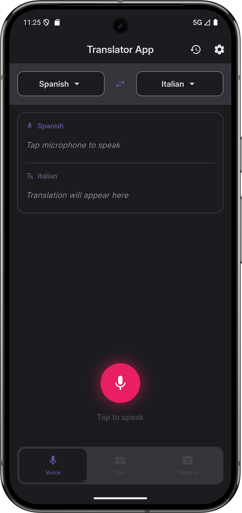
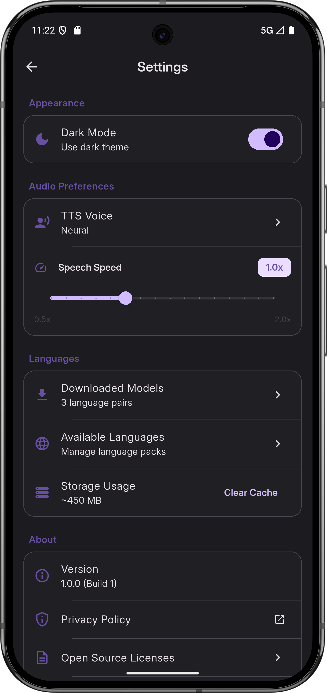

# AI Voice Translator

AI Voice Translator is a cross-platform Flutter application that enables real-time translation using voice, text, and (soon) camera input. The app supports multiple languages, provides a modern UI, and is designed for mobile and desktop platforms.

## Features

- 🎤 **Voice Translation:** Speak and get instant translations.
- 📝 **Text Translation:** Type text to translate between languages.
- 📷 **Camera Translation:** (Coming soon) Point your camera at text for instant translation.
- 🌗 **Theme Support:** Switch between light and dark modes.
- 🗣️ **TTS (Text-to-Speech):** Listen to translated text (coming soon).
- 📚 **Translation History:** View your recent translations.
- 🌐 **Multi-language Support:** Choose source and target languages.
- ⚙️ **Settings:** Manage appearance, audio preferences, and language models.

## Screenshots

<!--  -->

[//]: # (Settings page )


## Getting Started

### Prerequisites

- [Flutter SDK](https://docs.flutter.dev/get-started/install)
- Dart >= 3.0.0
- Android Studio / VS Code / Xcode (for platform-specific builds)

### Installation

1. **Clone the repository:**
   ```sh
   git clone https://github.com/yourusername/translator_apps.git
   cd translator_apps
   ```

2. **Install dependencies:**
   ```sh
   flutter pub get
   ```

3. **Run the app:**
   - **Android/iOS:**
     ```sh
     flutter run
     ```
   - **Web:**
     ```sh
     flutter run -d chrome
     ```
   - **Windows/Linux/macOS:**
     ```sh
     flutter run -d windows
     ```

### Project Structure

- `lib/` - Main application code
  - `core/` - Theme, constants, router, utilities
  - `features/` - Feature modules (onboarding, home, settings, history)
  - `assets/` - Images, icons, animations
- `android/`, `ios/`, `linux/`, `macos/`, `windows/`, `web/` - Platform-specific code

## Usage

1. **Onboarding:** Select your languages and grant microphone permission.
2. **Home Screen:** Choose input mode (voice, text, camera), perform translations, and view results.
3. **Settings:** Change theme, manage audio and language preferences.
4. **History:** Review previous translations.

## Contributing

Contributions are welcome! Please follow these steps:

1. Fork the repository.
2. Create your feature branch (`git checkout -b feature/my-feature`).
3. Commit your changes (`git commit -am 'Add new feature'`).
4. Push to the branch (`git push origin feature/my-feature`).
5. Open a pull request.

## License

This project is licensed under the MIT License. See the [LICENSE](LICENSE) file for details.

## Acknowledgements

- [Flutter](https://flutter.dev/)
- [Riverpod](https://riverpod.dev/)
- [Google Fonts](https://fonts.google.com/)
- [Lottie](https://lottiefiles.com/)
- [Permission Handler](https://pub.dev/packages/permission_handler)
- [Share Plus](https://pub.dev/packages/share_plus)

---

For help getting started with Flutter development, view the [online documentation](https://docs.flutter.dev/), which offers tutorials, samples, guidance on mobile development, and a full API reference.